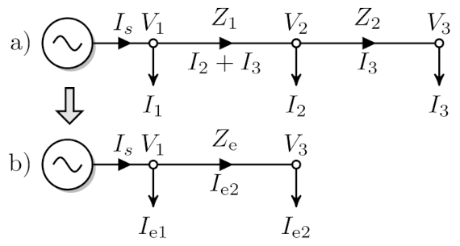
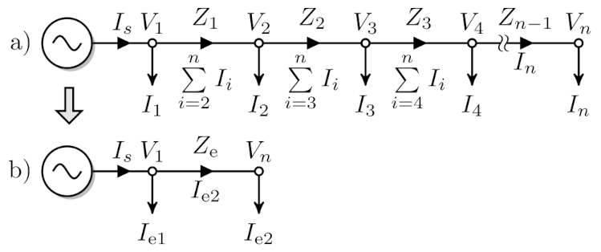
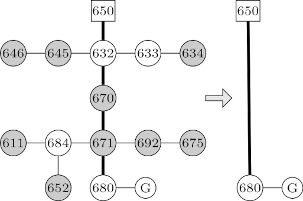

# Introduction

High-resolution power flow simulations for the detailed distribution system are
resource-intensive and time-consuming. In the past, various methods have been
proposed to create a simplified equivalent circuit while preserving essential
characteristics. However, discrepancies in power losses between original and
equivalenced feeders were observed. To resolve this issue, a modification is
suggested to maintain equality in the voltage drop, total feeder current/power,
and losses. Explicit formulas for multiple bus reduction are provided.
Examples demonstrate the effectiveness of the proposed method.

# Install

In the code we perform power flow computation using
[Matpower](https://github.com/MATPOWER/matpower).
Matpower can be run under [GNU Octave](https://octave.org) or Matlab,
therefore both GNU Octave (Matlab) and Matpower have to be installed.

We also use "direct" Python interface to [OpenDSS](https://github.com/dss-extensions/dss_python)
which can be installed with: `pip install dss_python`

The documentation for Python interface to OpenDSS is at https://dss-extensions.org/dss_python/dss/

# Example 1

|          |
| :-------------------------------: |
| Fig. 1. Single load bus reduction |

The file [`two_branches.m`](two_branches.m) contains the input data, in Matpower
format, for the simple feeder depicted in Fig. 1. In order to reduce the feeder
to a single line run the script [`reduction_1.m`](reduction_1.m) by the following
command at GNU Octave (Matlab) prompt `reduction_1`
```
Exact solution
DV = 0.0209 -0.0015j
DS = 0.0309 +0.0103j
 S = 1.8309 +0.8103j

Equivalent - match DV only
Ie1 = 0.6080 -0.3031j
Ie2 = 1.2229 -0.5072j
DV = 0.0209 -0.0015j
DS = 0.0263 +0.0088j
 S = 1.8309 +0.8103j
error(DP) = -14.93%

Equivalent - match both DV and DS
Ie1 = 0.3933 -0.2140j
Ie2 = 1.4376 -0.5963j
Ze = 0.0128 +0.0043j
DV = 0.0209 -0.0015j
DS = 0.0309 +0.0103j
 S = 1.8309 +0.8103j
error(DP) = 0.00%
```


# Example 2

|          |
| :---------------------------------: |
| Fig. 2. Multiple load bus reduction |

The file [`five_branches.m`](five_branches.m) contains the input data, in Matpower
format, for the simple multi-branch feeder depicted in Fig. 2. In order to reduce the feeder
to a single line run the script [`reduction_2.m`](reduction_2.m) by the following
command at GNU Octave (Matlab) prompt `reduction_2`
```
Exact solution
DV = 0.0510 -0.0015j
DS = 0.1116 +0.0372j
 S = 3.0116 +0.8372j

Equivalent - match both DV and DS
Ie1 = 0.8470 -0.0452j
Ie2 = 2.1646 -0.7920j
Ze = 0.0210 +0.0070j
DV = 0.0510 -0.0015j
DS = 0.1116 +0.0372j
 S = 3.0116 +0.8372j
error(DP) = 0.00%
Zs = 0.0270 +0.0090j
 g = 0.7780 +0.0000j
```


# Example 3

|          |
| :-------------------------------: |
| Fig. 3. IEEE 13-bus test feeder   |

The file [`IEEE13Nodeckt.dss`](IEEE13Nodeckt.dss) contains the input data, in
OpenDSS format, for the 13-bus three-phase feeder depicted in Fig. 3. In order
to reduce the feeder to a single line run the script [`ieee13.py`](ieee13.py) by
the following command `python ieee13.py`

The reduced feeder is in the file [`IEEE13-equivalent.dss`](IEEE13-equivalent.dss)
```
ORIGINAL FEEDER
      bus                   V1                   V2                    V3
sourcebus 57.502246+33.192753j -0.007663-66.396007j -57.494583+33.203254j
      650 2.401626-00.0003140j  -1.201130-2.079835j -1.2004820+2.0801110j
     rg60 2.521476-00.0003720j  -1.246136-2.157678j -1.2603370+2.1839340j
      633 2.430119-00.0816530j  -1.276028-2.115536j -1.1477540+2.1151200j
      634 0.273590-00.0124630j  -0.146523-0.238509j -0.1278490+0.2405110j
      671 2.372335-00.1642850j  -1.289601-2.147849j -1.0775850+2.0685570j
      645 0.0+0000000.0000000j  -1.271925-2.097573j -1.1497310+2.1160320j
      646 0.0+0000000.0000000j  -1.272546-2.092369j -1.1490690+2.1108260j
      692 2.372334-00.1642850j  -1.289601-2.147849j -1.0775850+2.0685570j
      675 2.356157-00.1733700j  -1.299115-2.148695j -1.0760000+2.0642260j
      611 0.0+0000000.0000000j 0.0+0000000.0000000j -1.0641900+2.0646020j
      652 2.354449-00.1609170j 0.0+0000000.0000000j  0.0+0000000.0000000j
      670 2.416910-00.1074840j  -1.280025-2.127877j -1.1219910+2.1023150j
      632 2.437504-00.0791270j  -1.276709-2.120522j -1.1509630+2.1206080j
      680 2.379946-00.1493710j  -1.277394-2.156817j -1.0953350+2.0662810j
      684 2.367609-00.1649160j 0.0+0000000.0000000j -1.0716860+2.0661550j

SELECTED FEEDER BACKBONE
Line.650632
Line.632670
Line.670671
Line.671680
Voltage drop DV = [0.142+0.149j 0.031-0.001j -0.165+0.118j] kV
Power losses DS = [56.049+178.323j] kVA

FEEDER REDUCTION ACCOUNTING FOR VOLTAGE DROP ONLY
Ze =
[[0.328+0.964j 0.148+0.475j 0.150+0.401j]
 [0.148+0.475j 0.320+0.992j 0.145+0.364j]
 [0.150+0.401j 0.145+0.364j 0.323+0.980j]] Ohms
Ie2 = [230.518-175.907j -113.225-51.252j 9.565+281.012j] A
Ie1 = [127.398-72.359j -139.536-101.621j 8.140+179.499j] A
Power losses DSe = [34.404+108.436j] kVA

FEEDER REDUCTION ACCOUNTING FOR VOLTAGE DROP AND LOSSES SIMULTANEOUSLY
g = [0.609+0.002j]
Ze =
[[0.198+0.587j 0.089+0.289j 0.090+0.244j]
 [0.089+0.289j 0.193+0.604j 0.088+0.222j]
 [0.090+0.244j 0.088+0.222j 0.195+0.597j]] Ohms
Ie2 = [377.985-290.054j -186.266-83.711j 16.960+461.689j] A
Ie2-Ig = [517.494-298.810j -254.030-198.127j -49.797+587.621j] A
Ie1 = [-20.069+41.787j -66.494-69.162j 0.745-1.177j] A
Power losses DSe = [56.049+178.323j] kVA

REDUCED FEEDER
      bus                   V1                   V2                    V3
sourcebus 57.502246+33.192754j -0.007663-66.396007j -57.494583+33.203253j
      650 2.401626-00.0003140j  -1.201130-2.079835j -1.2004820+2.0801110j
     rg60 2.521476-00.0003720j  -1.246136-2.157678j -1.2603370+2.1839340j
      680 2.379946-00.1493720j  -1.277395-2.156818j -1.0953360+2.0662810j
Voltage drop DV = [0.142+0.149j 0.031-0.001j -0.165+0.118j] kV
Power losses DS = [56.048+178.299j] kVA
```
